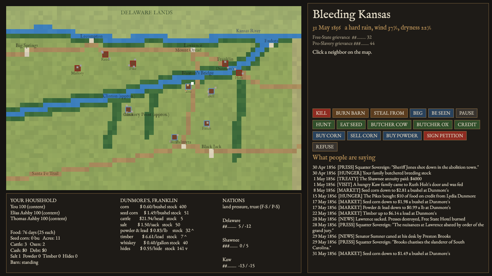

# 1856
Bleeding Kansas: The Game

A systems-driven survival narrative prototype set in Kansas Territory, exploring attribution, memory, faction pressure, and emergent historical consequence.

## Project status

This repository currently contains:

- a headless simulation core (`src/sim/`) with no engine dependency (master plan §21)
- a Bevy view that draws the sim on a map of Douglas County and forwards the player's verbs
- a lab tool, metrics and benchmarks for tuning systems in isolation
- a Part I design extension pack focused on temporal drift, narrative scarcity, and identity fragmentation

## Included docs

- [PART I — The Substrate (Extensions)](PART_I_EXTENSIONS.md)

## The simulation

Douglas County, Kansas Territory, from November 1855, on a real map at half a
mile to the tile. Eight families, your claim south of Lawrence, Dunmore's store
in Franklin, the Delaware across the Kaw and the Shawnee to the east.



Everything lives in `src/sim/` with no engine in it (§21). Module by module:

| Module | What it simulates |
| --- | --- |
| `events`, `world` | The event bus (§15): systems emit, never call. Cascade depth limit, `caused_by` links across days, seeded determinism (§18). |
| `attribution` | Nobody sees causes (§11). Suspects scored on hatred, proximity, motive, hunger, pattern, alibi, rumor; the answer is acted on with full force. |
| `systems` | Fire and its spread (§12), perception and witnesses, gossip that mutates and can overturn beliefs, revenge, feuds, faction grievance, wounds, cruelty, favors, the press. |
| `economy` | Slow capital (§10): food, seed corn, breeding stock, oxen, debt. Hungry families eat the seed, butcher stock, borrow, beg, hunt, go west, or steal, by temperament. |
| `market` | Eight goods at Dunmore's with stock-driven prices, seasonal Westport freight, blockades, county demand, a fall glut. Anyone who corners corn is resented and robbed. |
| `psyche`, `character` | Body, temperament, emotions that spread, public vs private ideology; archetypes that emerge from stat combinations; hidden luck and malice. Every stat drives a mechanic. |
| `history` | The real 1855–57 timeline with mechanical effects, and the Herald of Freedom, Kansas Free State and Squatter Sovereign printing their side's version. |
| `nations` | The Delaware, Shawnee and Kaw as sovereign actors: timber trespass, agents who rarely act, annuities docked for settler claims, hungry visits, adoption by council. |
| `bison` | The herd west of the county, the robe trade, the Kaw fall hunt, trips to the range. |
| `geography` | The county map: Kaw, Wakarusa, timber belts, roads, towns, claims. Terrain drives sightlines, fire and timber. |
| `debug` | Daily metrics, event trace, and `explain_*` for people, blame and prices. |

### The lab

Run one system at a time and look inside it:

```bash
cargo run --bin lab --no-default-features -- map                # the county as text
cargo run --bin lab --no-default-features -- npc Pike --days 200 # a person, hidden stats and all
cargo run --bin lab --no-default-features -- events fire         # find event ids
cargo run --bin lab --no-default-features -- blame 16            # why each witness blamed who they did
cargo run --bin lab --no-default-features -- tree 16             # the cascade under an event
cargo run --bin lab --no-default-features -- corner corn 500 90  # buy up the corn, watch the county react
cargo run --bin lab --no-default-features -- gate                # Phase 1 and Phase 2 gates across seeds
cargo run --bin lab --no-default-features -- evil                # cruelty, and who got blamed for it
cargo run --bin lab --no-default-features -- metrics out.csv     # daily metrics for charts
cargo run --bin lab --no-default-features -- time                # cost of a simulated year
```

Options: `--seed N --days N --seeds N --winter X` (0.5 mild … 1.6 brutal).

### Headless chronicle

```bash
cargo run --bin headless --no-default-features -- --seed 15 --truth   # the year, with true causes
cargo run --bin headless --no-default-features -- --survey 60         # wars from nothing, across seeds
```

### The game

```bash
cargo run
BK_SEED=15 BK_START_DAYS=200 cargo run   # start in May 1856
```

Click a neighbor to read them. Violence (kill, burn, steal), hunger (hunt, the
buffalo range, eat seed, butcher, credit, beg), trade at Dunmore's, and the
storekeeper's petition. Space pauses. The log shows only what the county is
saying, never what happened.

Type: IM Fell English and EB Garamond, both under the SIL Open Font License
(`assets/fonts/`).

### Tests and benchmarks

```bash
cargo test --no-default-features          # unit tests in every module, plus the gates
cargo bench --no-default-features         # tick, attribution and market costs
```

The Phase 1 gate ("can the sim start a war nobody started?") and the Phase 2
gate ("does a bad winter change the politics six months later?") are both tests.

## Design direction

The core design intent is not just a political sim. The game is built around the idea that:

- events are misinterpreted before they are understood
- narratives compete for attention
- institutions harden one version of reality
- legal truth, social truth, and faction truth do not match

The goal is a world where the player can be correct, still be blamed, and still lose because the simulation has already decided what happened.
